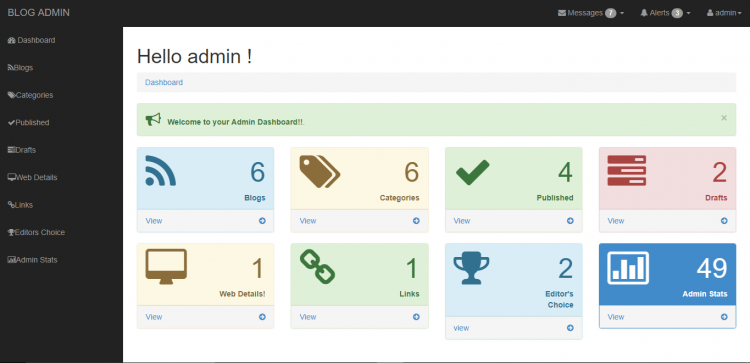
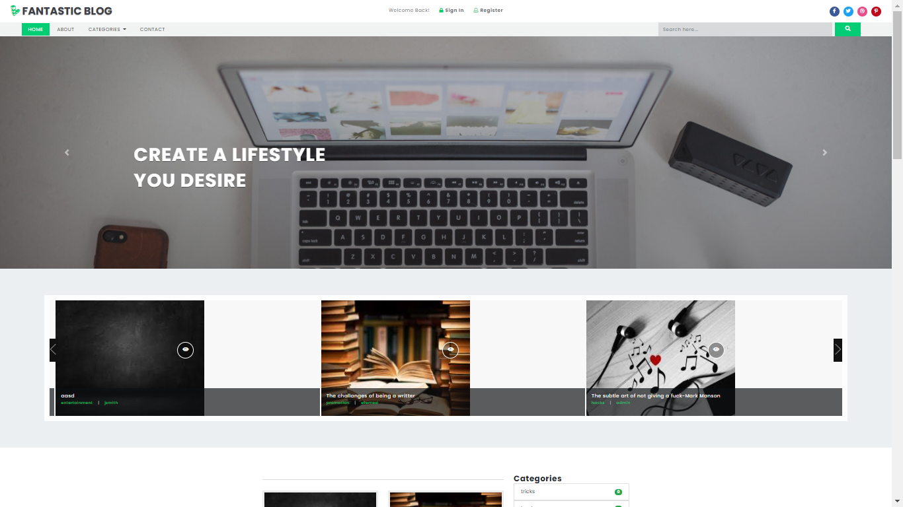

# Fantastic Blog (CMS) in PHP with Source Code

	

### Description
Fantastic Blog is PHP Content Management System project. This is an absolutely fantastic web content management system for blogs/articles. It enables you to easily manage your website or blog without much hustle. With this system, you will run your blog like a boss. It provides you a wide range of capabilities to customize your blog to fit your needs. It has great features and you don't have to touch any code to have your blog up and running.

### Features

<strong>Admin</strong>
<ul>
	<li><strong>Manage Users</strong></li>
	<li><strong>Manage Categories</strong></li>
	<li><strong>Manage Blogs</strong></li>
	<li><strong>Manage Website Links</strong></li>
	<li><strong>Manage Web Details</strong></li>
	<li><strong>Manage Editors Choice Blogs</strong></li>
	<li><strong>Website Visit/Visitors Report</strong></li>
</ul>
<strong>Author</strong>
<ul>
	<li><strong>Manage Own Blogs</strong></li>
	<li><strong>View Categories</strong></li>
</ul>
<strong>Vistor's</strong>
<ul>
	<li><strong>Explore Website</strong></li>
	<li><strong>Read Blogs/Articles</strong></li>
	<li><strong>Register as An Author</strong></li>
	<li><strong>Comment to Blogs</strong> (Note:Facebook plugin is the default but you can manage the comment script in admin panel)</li>
	<li>and <strong>many more</strong></li>
</ul>

Visit [www.sourcecodester.com](https://www.sourcecodester.com/php/12258/fantastic-blog-cms-php.html) for more detailed information and instruction for running the Fantastic Blog.

### Website Info
| Title | Fantastic Blog (CMS) in PHP with Source Code |
|:-----|:--------|
| Website | [www.sourcecodester.com](https://www.sourcecodester.com) |
| Link | https://www.sourcecodester.com/php/12258/fantastic-blog-cms-php.html |
| Developer/Uploader | [Ronald Ngoda](https://www.sourcecodester.com) |
